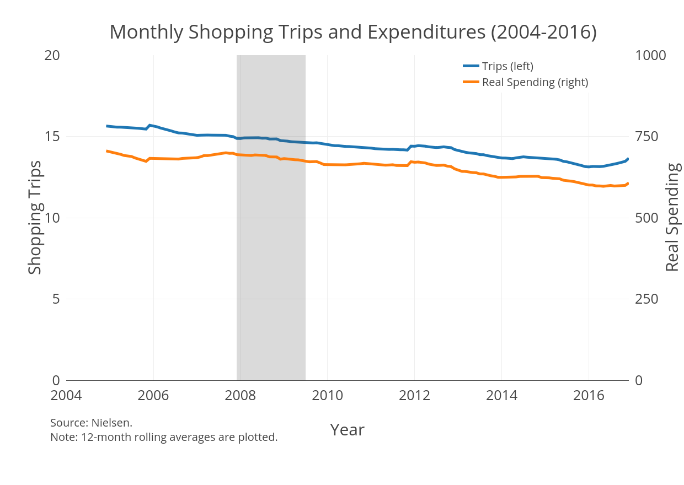
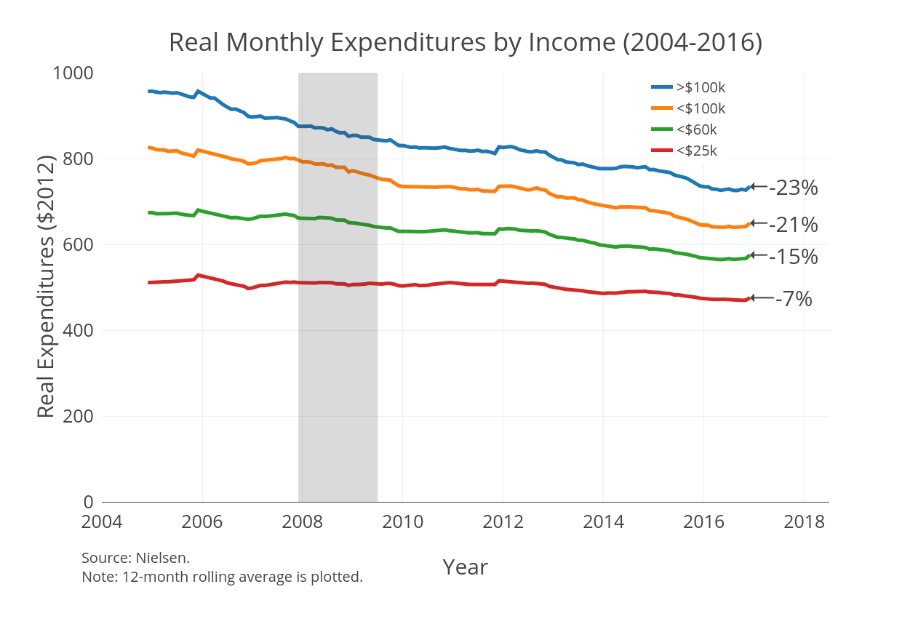
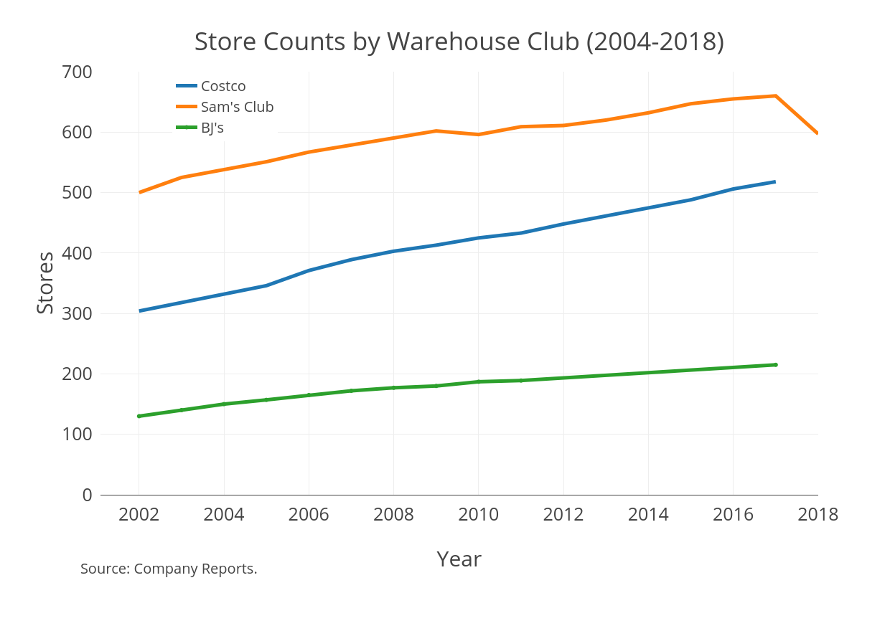

### Overview
* Real expenditures on household staples have declined since 2004
* Shopping frequency has also declined
* These gains are not being shared equally across income groups

### Aggregate Facts

### Motivation

### Persistent Across Household Sizes

### Persistent Across Household Sizes

### Persistent Across Household Sizes

### Persistent Across Household Sizes

### Persistent Across Household Sizes

### Warehouse Clubs

### Research Question
* What factors are driving these savings and how important are they?
    + Growth of warehouse clubs?
    + Increased bulk buying?
    + Overall price declines for household staples?
    
* What are the key drivers of these differences?
    + Differing access to stores (e.g. transportation costs)?
    + Different purchasing behavior (e.g. liquidity constraints)?

### Possible Sources of Gap
1. Households have different access to various shopping channels
2. Households behave differently conditional on shopping in the same store

Kaplan and Menzio (2014) document the following variance decomposition of household price indexes:

* 50% from shopping at different types of stores
* 40% from purchasing different products within similar types of stores
* 10% from price differences for the same product at the same store

### Unconditional Shopping Behavior (Spending)

### Conditional Shopping Behavior (Spending)

### Reduced-Form Strategy

$$
Y_{hst}^i = \beta_i * d_{hst} + \lambda_h + \lambda_t + \epsilon_{hst}
$$

* $Y$ is an indicator for household $h$ of income level $i$ shopping at store $s$ in month $t$
* $d$ is the distance to the closest store $s$
* $\lambda$ are household and time fixed effects
* $\beta$ should provide an estimate of how costly distance is for different households

### Other Related Work
* Orhun and Palazzolo (2018) use timing of purchases during the month to get estimate of liquidity constraints on bulk buying and taking advantage of sales.
* Relaxing liquidity constraints enable low-income households to better take advantage of sales
* Low-income households only marginally take advantage of bulk buying when relaxed

### Next Steps
* Patterns suggest bulk buying. Look at actual quantities being purchased
* Collect data on locations and openings for warehouse clubs to estimate regression
* Look at purchasing patterns of particular products
* Identify similar product/brand across different channels
