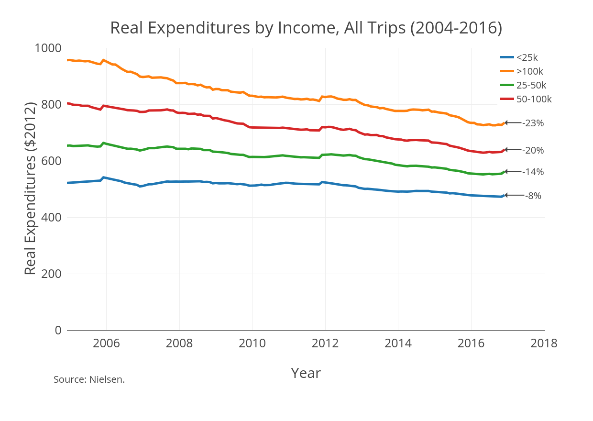
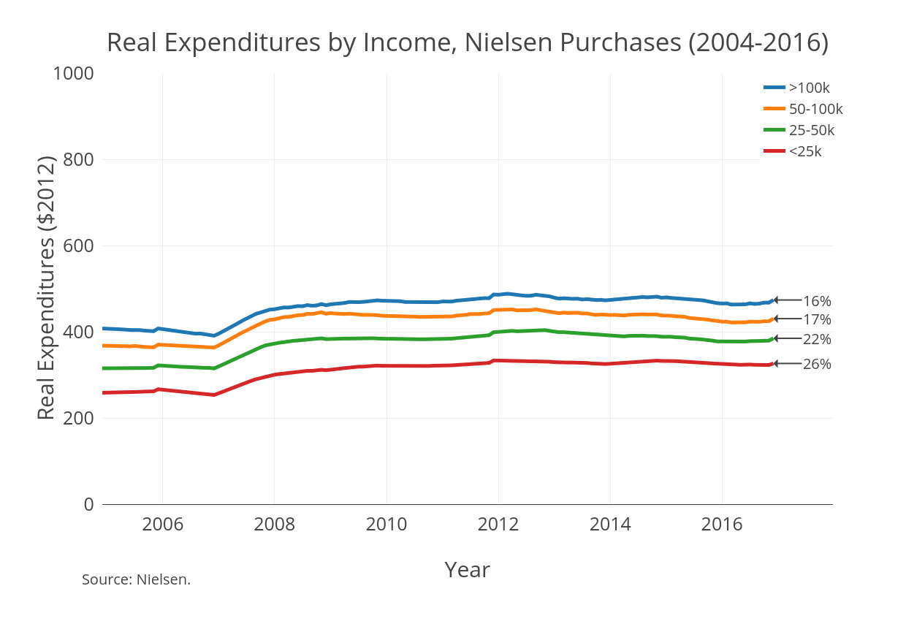
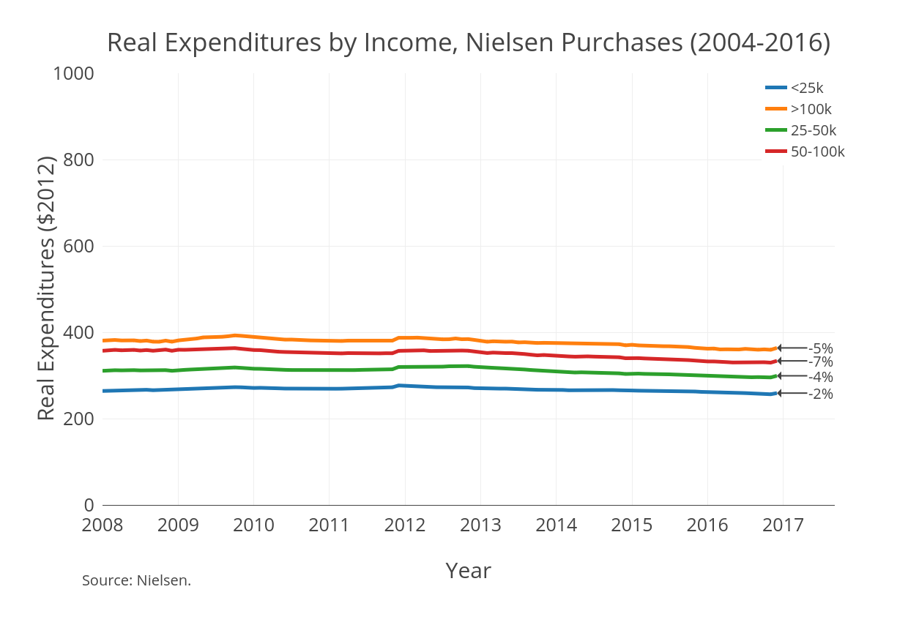
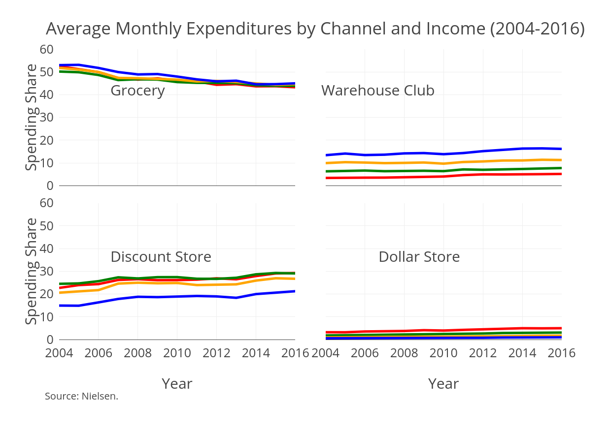
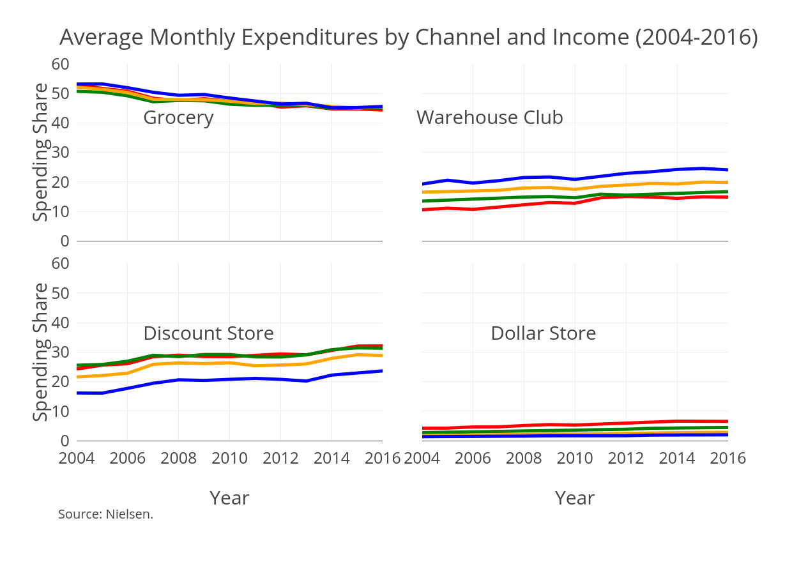
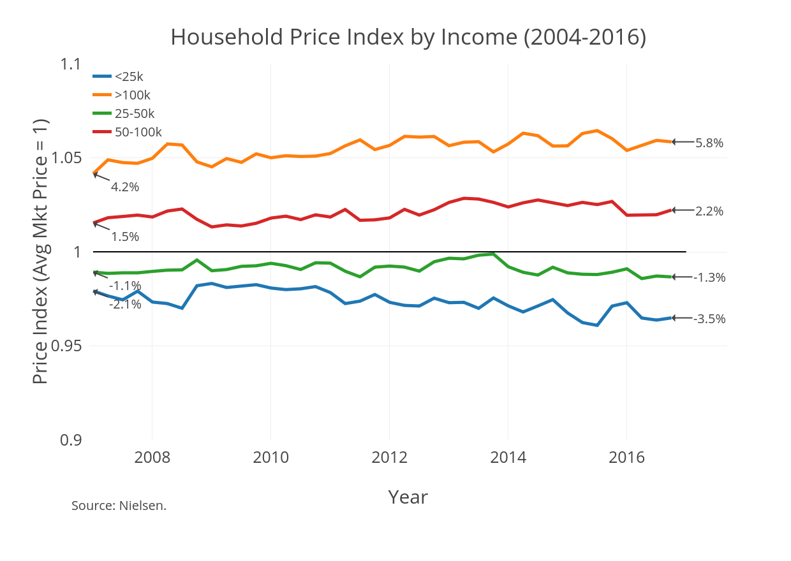

### Overview
* Spending declines are not robust to analysis

### Previously

### Corrections
* Dropping non-Nielsen trips

### Corrections
* Only spending on Nielsen products

### Corrections
* After 2007 correction for new scanner

### Unconditional Shopping Behavior (Adjusted)

### Conditional Shopping Behavior (Adjusted)

### Price Index (Kaplan and Menzio 2014 / Aguiar and Hurst 2007)
* Different households may pay different prices for the same "good"
* **Goal**: Construct an index that enables comparison of expenditures across households
* Key choice is over the appropriate definition of "good"

### Price Index

\begin{align*}
X_{it} &= \sum_{j} P_{jit} q_{jit} \\
\bar{X}_{it} &= \sum_{j} \bar{P}_{jmt} q_{jit} \\
p_{it} &= \frac{X_{it}}{\bar{X}_{it}}
\end{align*}

* $P$ is the price paid for good $j$ by household $i$ at time $t$
* $\bar{P}$ is the average price of good $j$ in market $m$ at time $t$
* $q$ is the quantity of $j$ purchased by household $i$ at time $t$
* $X$ is total expenditures by household $i$ at time $t$
* $\bar{X}$ is household expenditures if purchased at the average market price
* $p$ is the relative price index for household $i$ at time $t$

### Price Index

### Price Index Takeaways
* Households making over \$50k are paying above average prices for the same good
* Households making less than \$50k are paying lower than average prices for the same good
* Gap has been increasing over time

### Relationship Between Index and Shopping Behavior

<!-- \input{../code/5_figures/tables/table8Menzio.tex} -->

### Relationship by Income

\begin{table}[!htbp] \centering 
  \caption{Effect of Shopping Behavior on Price Index} 
  \label{} 
  \resizebox{0.5\textwidth}{!}{%
\begin{tabular}{@{\extracolsep{5pt}}lccc} 
\\[-1.8ex]\hline 
\hline \\[-1.8ex] 
 & \multicolumn{3}{c}{Household Price Index} \\ 
\cline{2-4} 
\\[-1.8ex] & (1) & (2) & (3)\\ 
\hline \\[-1.8ex] 
 Shopping Trips & $-$0.002$^{***}$ &  & $-$0.001$^{***}$ \\ 
  & (0.00001) &  & (0.00001) \\ 
  & & & \\ 
 Stores Visited &  & $-$0.009$^{***}$ & $-$0.004$^{***}$ \\ 
  &  & (0.0001) & (0.0001) \\ 
  & & & \\ 
 >50k & 0.037$^{***}$ & 0.037$^{***}$ & 0.035$^{***}$ \\ 
  & (0.0004) & (0.0005) & (0.0005) \\ 
  & & & \\ 
 Trips * >50k & 0.0001$^{***}$ &  & 0.0001$^{***}$ \\ 
  & (0.00001) &  & (0.00002) \\ 
  & & & \\ 
 Stores * >50k &  & 0.001$^{***}$ &  \\ 
  &  & (0.0001) &  \\ 
  & & & \\ 
 Stores * >50k &  &  & 0.0005$^{***}$ \\ 
  &  &  & (0.0001) \\ 
  & & & \\ 
\hline \\[-1.8ex] 
Observations & 2,901,150 & 2,901,150 & 2,901,150 \\ 
R$^{2}$ & 0.030 & 0.025 & 0.031 \\ 
Adjusted R$^{2}$ & 0.029 & 0.025 & 0.031 \\ 
\hline  
\hline \\[-1.8ex] 
\textit{Note:}  & \multicolumn{3}{l}{$^{*}$p$<$0.1; $^{**}$p$<$0.05; $^{***}$p$<$0.01} \\ 
 & \multicolumn{3}{l}{Market and quarter fixed effects are included.} \\ 
\end{tabular} 
}
\end{table} 
