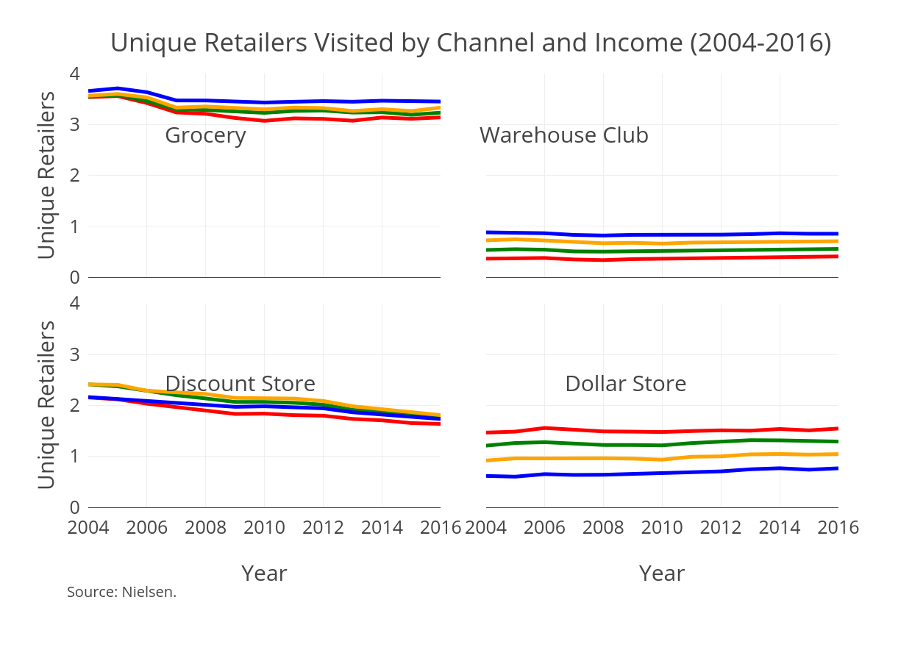
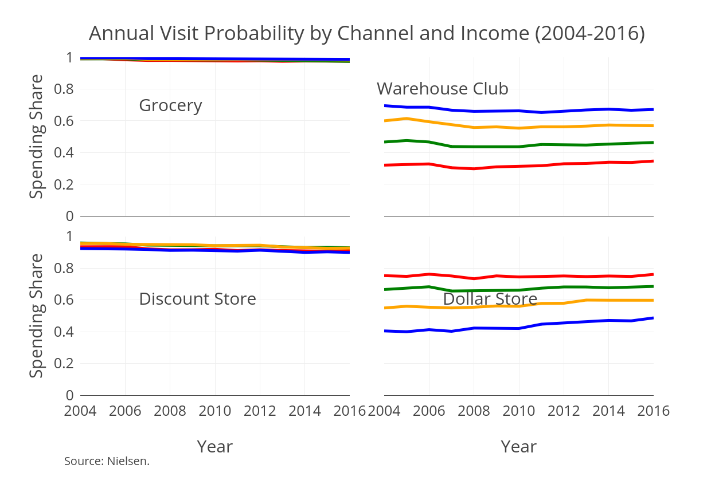
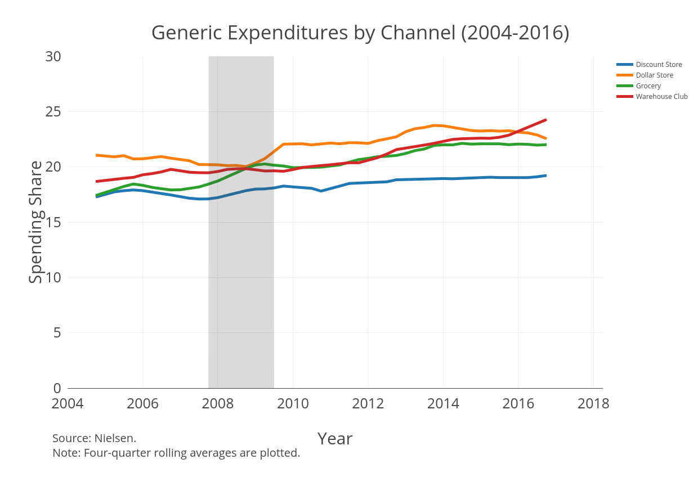

### Motivation
* Households are shopping less

### Motivation
* Households are shopping at fewer unique stores

### Motivation
* Propensities differ across store types

### Linear Probability Regression
\tiny
\input{../code/6_paper/tables/channelPropensity.tex}

### Channel Correlation 
\input{../code/6_paper/tables/channelCor.tex}

### Research Questions
1. Why do households shop at different stores? 
    + How important are transportation costs? Is it something else?
    
2. What are the consequences of different shopping patterns?
    + Do households pay different unit prices? 

### Unit Price Heterogeneity (Water)
\tiny
\input{../code/6_paper/tables/water.tex}

### Unit Price Heterogeneity (Tissue)
\tiny
\input{../code/6_paper/tables/tissue.tex}

### Unit Price Heterogeneity (Diapers)
\tiny
\input{../code/6_paper/tables/diaper.tex}

### Unit Price Heterogeneity (Toilet Paper)
\tiny
\input{../code/6_paper/tables/tp.tex}

### Generics

### Next Steps
* Schedule proposal defense. What are expectations for defense?
* Send "Value of Variety" paper. 
    + Only found Quan and Williams (2018) and Brynjolffson, Hu, and Smith (2003)
* Estimate linear probability model incorporating Costco openings
    + Provides a baseline for the importance of distance
* Get distributions of sizes purchased per trip and within stores
