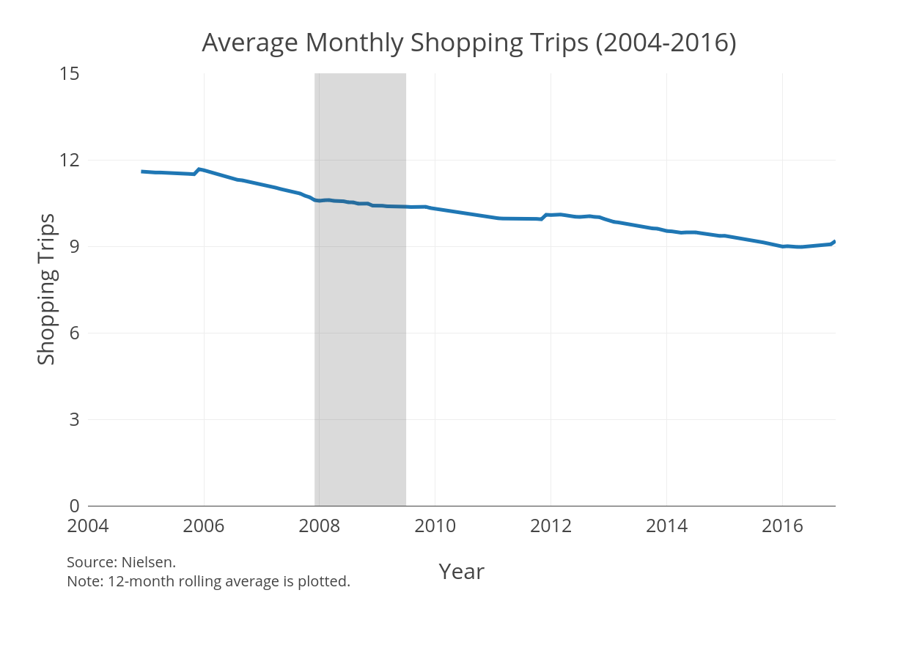
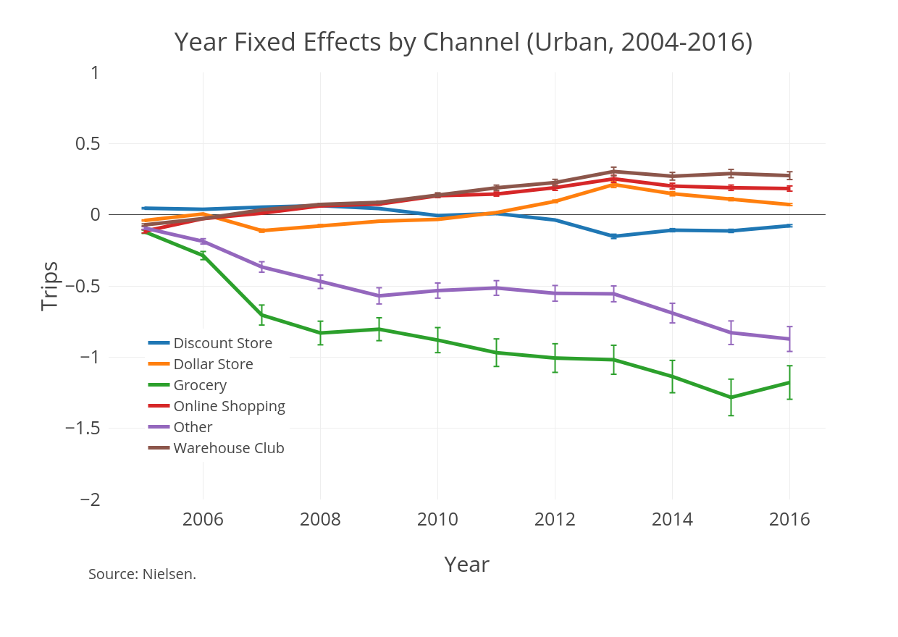
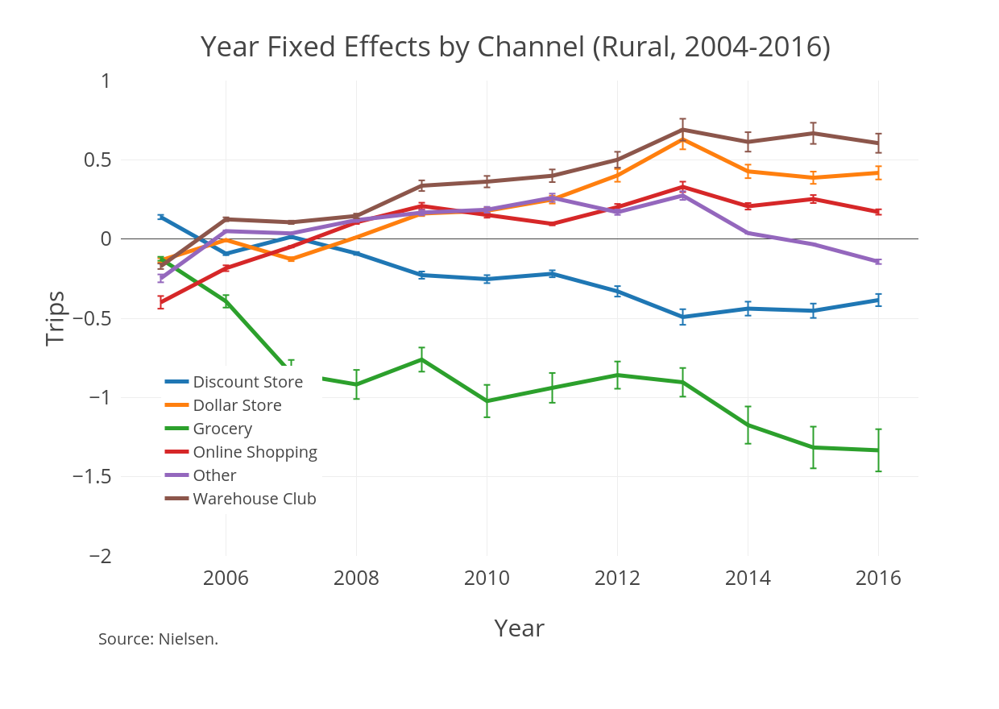

# Updates

### Jessie
  + Advice on using Nielsen (cleaning tips)
  + Get unit cost differences between rich and poor households quickly
  + Tips on estimating store distances
    
### Unit Costs (Toilet Paper)
\input{../code/6_paper/tables/tpUnitCost.tex}

### Holger
  + Unit cost regression could be that rich households' price sensitivity outweights quantity discounts
  + 2 separate questions to pursue:
      * Given the substantial changes in local stores (more supercenters and dollar stores), what characteristics drove failing stores out and what are new stores selling? Product selection? Prices?
      * Use differences in trip frequency and sizes to estimate household's cost of time. Can use to estimate welfare implications of online shopping
        
### Aviv
  + Verify existence of bulk discount (given unit cost regression)
  + Focus on costs related to product size
      * Develop simple model where product size matters
  + Relate question to consumption inequality
  + Since Nielsen is becoming more well used, consider incorporate timespan for more mileage
  
### Bulk Discount
\input{../code/6_paper/tables/tpBulkDiscount.tex}
    
### Sarah
  + Explore what other research has done
  + Check descriptives against theirs, if none, then document
  + Focus on that poor households do not take advantage of quantity discounts
  + Decompose into transportation costs, liquidity constraints, and time/travel costs
      * Link these costs to policy prescriptions to run counterfactuals
      * Welfare benefit disbursement (liquidity)
      * Costco membership fees (liquidity)
      * Car ownership (transportation costs)
      * Online shopping (time/travel costs)

# Descriptives
### Motivation
* Households are shopping less 

### Motivation
* There have been secular shifts in shopping behavior 
* There are persistent differences between rich and poor households

### Secular Trends In Stores

### Secular Trends In Stores

### Next Steps
* Explore current literature on consumption inequality
* Compare descriptive statistics to previous estimates
