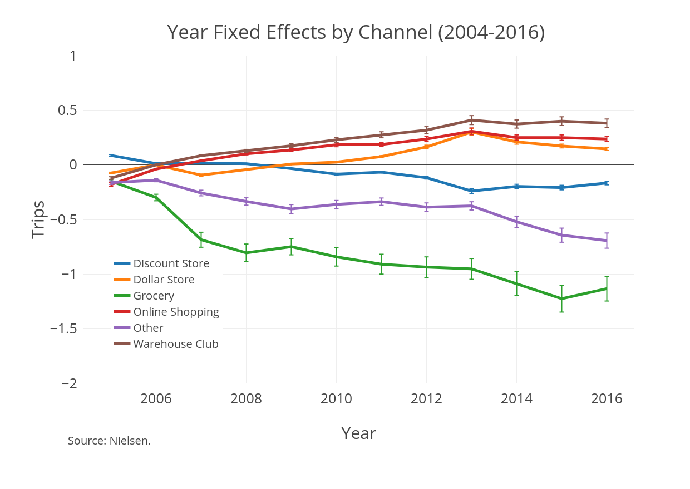
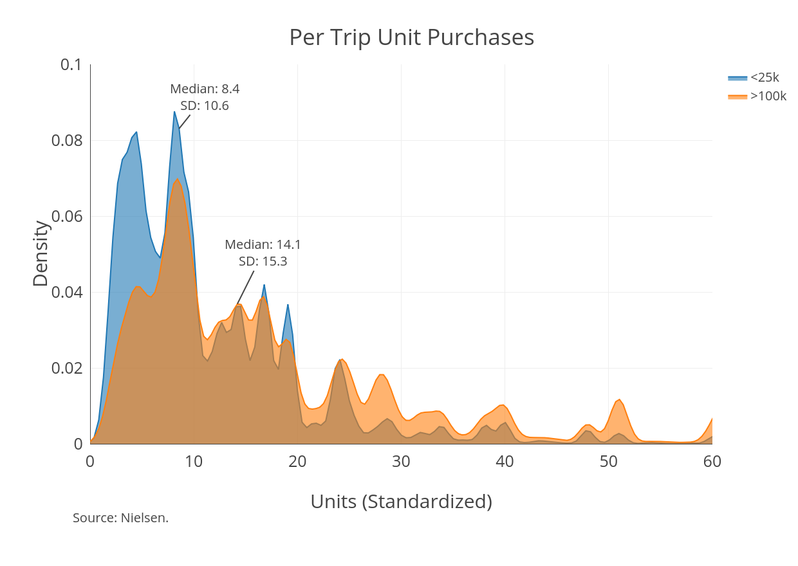
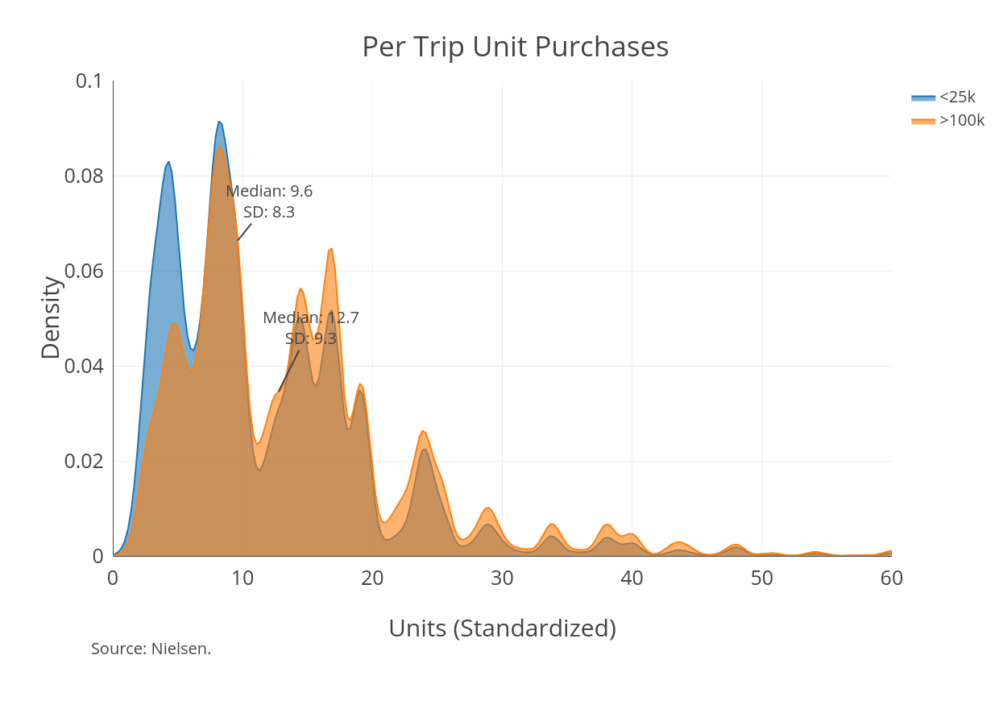

### Motivation
* Smooth consumption does not imply smooth expenditures

### Motivation
* Households are shopping less 

### Motivation
* There have been secular shifts in shopping behavior 
* There are persistent differences between rich and poor households

### Descriptives

### Descriptives

\tiny
\input{../code/6_paper/tables/tripChanges.tex}

### Example: Toilet Paper

### Quantity Discount
\input{../code/6_paper/tables/tpBulkDiscount.tex}

### Possible Factors
* Access?
* Travel/Time Costs?
* Liquidity Constraints?
* Transportation Costs?

### Large Discount Store

### Where are the Savings?

\tiny
\input{../code/6_paper/tables/tpUnitCost.tex}

### Big Picture
* Growing interest in income volatility, especially at a sub-annual level
* Could volatile income or volatile expenses generate this shopping behavior?
* How costly is this spending pattern over the course of a year?
* Should we refine welfare benefits as a result?

### Model Overview
* Each period, households purchase a "necessity" good and an outside good
* Utility is increasing in the outside good, conditional on consuming a minimum amount of the "necessity" good
* "Necessity" good is storable and can be purchased in different sizes
* Per-period income is fixed, but expenses are volatile
* **Question:** Would this model generate these different spending patterns? Under what conditions?
